# Evidencia Demonstración - Paradigmas de programación
## Planteamiento
### Contexto
En entornos urbanos con alto flujo vehicular, los sistemas de monitoreo de tráfico requieren procesar múltiples fuentes de información en tiempo real.

Cámaras, sensores de velocidad y detectores de presencia generan datos de manera simultánea, en cambio, un sistema secuencial puede provocar retrasos en el análisis de eventos críticos como congestiones, accidentes o saturación de intersecciones.

#### Propósito
El propósito de este proyecto es optimizar el flujo de información y realizar cálculos estadísticos sobre la velocidad y el volumen vehicular de manera eficiente, en contextos de sistemas de tráfico (simulados) con varios sensores que envíen simultáneamente información de eventos y que necesiten ser procesados de manera centralizada y con eficiencia. 

Se implementará en python, utilizando herramientas nativas, un sistema de simulación para el monitoreo de tráfico inteligente con un mecanismo para mejorar el procesamiento de múltiples eventos simultáneos.
Se someterá a determinadas pruebas para la comparación con una solución secuencial y concluir sobre su utilidad.

### Alcance
El proyecto contempla:
- Simular múltiples sensores de tráfico que generen datos simultáneamente
    - Simular variabilidad en captado de variables (velocidad con que captan los sensores, variación en la velocidad de eventos, variación en catidad de coches que involucrados en cada evento).
- Procesar, utilizando mecanismos de concurrencia, determinados eventos de entrada
- Generar mediciones básicas del tráfico
- Comparar la solución concurrente/paralela con una solución secuencial
- Medir tiempos de ejecución

El proyecto no contempla:
- Integración con hardware real ni bases de datos
- Interfaces avanzadas
- Comunicación distribuida entre múltiples equipos

## Ambiente
Se utilizó Python 3.13.5, y dentro de los scripts, las bibliotecas nativas `threading`, `multiprocessing`, `queue`, `argparse`, `random`, `time`. Debian 13, el sistema operativo. 

## Paradigmas a utilizar
### Programación Concurrente
Para la gestión de los múltiples sensores que generan eventos y producen información simultáneamente (procesarlos en tiempo real), buscando evitar bloqueo del sistema principal. Cada sensor representará una tarea independiente.

Se utilizará:
- `threading`
- `queue`
- Bloqueos simples para sincronización

### Programación Paralela
Para llevar a cabo cálculos estadísticos sobre grandes conjuntos de datos de tráfico, en paralelo, buscando reducir el tiempo de procesamiento a través del aprovechamiento de múltiples núcleos del procesador, pues se consideró a las limitaciones de los hilos en Python debido al GIL (Global Interpreter Lock) que no permite la ejecución de varios hilos a la vez; No haber usado esto, habría supuesto una ejecuión secuencial de hilos pero usar subprocesos como lo plantea R. Eggen et al. (2019, como se citó en Aziz et al., 2021).

Se utilizará:
- `multiprocessing`
- División de carga de trabajo entre procesos.

## Modelos
### Explicar la lógica, paradigma y arquitectura de la solución
La arquitectura propuesta sigue un modelo productor-consumidor, útil para separar a los procesos que producen datos, de aquellos que les consumen datos.  Bajo este patrón, se acopla el intercambio de información que se da entre distintos ciclos que corren a ritmo distinto.

#### Flujo lógico
1. Los sensores generan eventos de tráfico
2. Cada sensor trabaja concurrentemente.
3. Los eventos se almacenan en una cola compartida.
4. Un consumidor central procesa los eventos.
5. Los datos acumulados se envían a procesos paralelos.
6. Los procesos calculan métricas de tráfico.
7. El sistema genera reportes.

#### Paradigma Concurrente
Los sensores (hilos independientes) producen eventos simultáneamente, enviados a una cola compartida para su posterior procesado.

#### Paradigma Paralelo
Dispone de los eventos de la cola y esos datos son divididos para su análisis estadístico entre dos procesos, aquel que calcula el promedio de velocidad, y el que calcula la cantidad de vehículos.

#### Detalles
El uso de la cola resolvió el problema descrito por Herzner (2003), _"The generation of information elements like requests or events must be decoupled from their processing, but the order in which they are processed must be the same in which they have been generated."_, ante una necesidad de intercambiar eventos una vez que hayan sido producidos (en tiempo diferido) y como uso de mecanismo de almacenamiento temporal para el intercambio asíncrono de eventos (que el consumidor no requiera de que el productor haya terminado).

Además, el uso de `queue.Queue()` permitió evitar race conditions en que se accediera a un mismo recurso y que la comunicación descrita anteriormente, se diera de manera 'Thread-safe' si consideramos el manejo de excepciones y tipo de estructura. Y, como sugiere Herzner (2003), la cola resultó ser una estructura conveniente pues permitió mantener el orden de procesamiento en la comunicación asíncrona entre productor-consumidor.

#### Arquitectura Gral,
- Capa de generación de eventos.
- Cola compartida.
- Procesador concurrente.
- Motor paralelo de análisis.
- Generador de resultados.

### Diagramas
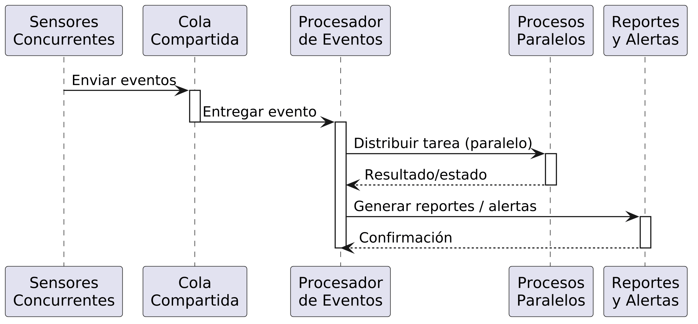

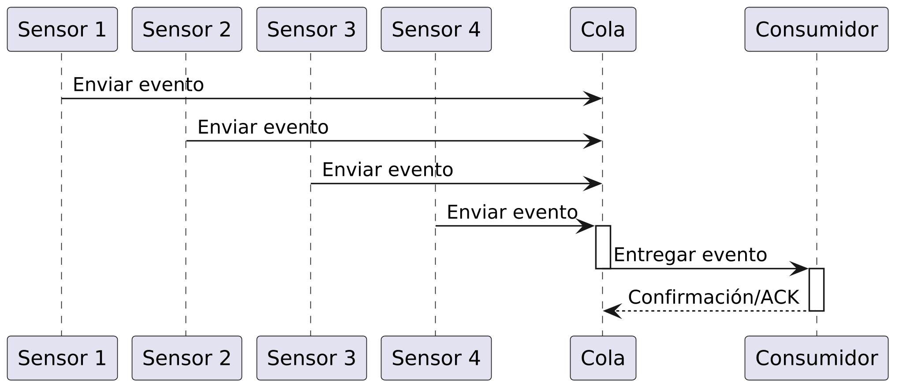

## Implementación
### Código
Dentro de los archivos `monitorear_trafico.py` y `secuencial_trafico.py` se encuentran las implementaciones del sistema de simulación de tráfico en sus formas paralela/concurrente y secuencial, respectivamente.

#### Cómo Ejecutar
```
python monitorear_trafico.py --sensores 6 --vehiculos 100 --output "nombre_archivo.txt"

python secuencial_trafico.py --sensores 6 --vehiculos 100 --output "nombre_archivo.txt"
```

Parámetros:
- `--sensores` representa el número de hilos*
- `--vehiculos` representa los eventos generados por cada sensor
- `--output` representa el nombre del archivo de salida

\* Hilos además del MainThread y del hilo del consumidor, en la concurrente 

## Pruebas
### Descripción
Se evaluaron criterios como **correcta ejecución concurrente de sensores y sincronización mediante colas** para establecer la correcta ejecución de la solución concurrente.

También se evaluó la efectiva reducción de tiempos frente a una solución secuencial.

### Escenario de prueba
Se efectuaron, con determinados parámetros, cinco pruebas de comparativa entre ambas soluciones, registrando resultados como se detalla a continuación.

Comando para correr las pruebas: `python pruebas.py`

<details><summary>Log de pruebas</summary>

```text

==================================================

PRUEBA 1:

Número de sensores: 1

Número de vehículos: 15

Ejecutando sistema concurrente...

Terminada la ejecución

Ejecutando sistema secuencial...

Terminada la ejecución

==================================================

Resultados de concurrente
==================================================

Tiempo: 15.166781902313232

Promedio de velocidad: 63.46666666666667

Total de vehículos: 352

==================================================

Resultados de secuencial
==================================================

Tiempo: 8.560069561004639

Promedio de velocidad: 65.73333333333333

Total de vehículos: 438


==================================================

Solución SECUENCIAL demostró ser óptima.
==================================================


==================================================

PRUEBA 2:

Número de sensores: 2

Número de vehículos: 15

Ejecutando sistema concurrente...

Terminada la ejecución

Ejecutando sistema secuencial...

Terminada la ejecución

==================================================

Resultados de concurrente
==================================================

Tiempo: 18.413175344467163

Promedio de velocidad: 66.96666666666667

Total de vehículos: 932

==================================================

Resultados de secuencial
==================================================

Tiempo: 16.681512355804443

Promedio de velocidad: 55.4

Total de vehículos: 898


==================================================

Solución SECUENCIAL demostró ser óptima.
==================================================


==================================================

PRUEBA 3:

Número de sensores: 3

Número de vehículos: 35

Ejecutando sistema concurrente...

Terminada la ejecución

Ejecutando sistema secuencial...

Terminada la ejecución

==================================================

Resultados de concurrente
==================================================

Tiempo: 30.07377600669861

Promedio de velocidad: 62.00952380952381

Total de vehículos: 2972

==================================================

Resultados de secuencial
==================================================

Tiempo: 63.32835030555725

Promedio de velocidad: 57.63809523809524

Total de vehículos: 2817


==================================================

Solución CONCURRENTE demostró ser óptima.
==================================================


==================================================

PRUEBA 4:

Número de sensores: 6

Número de vehículos: 50

Ejecutando sistema concurrente...

Terminada la ejecución

Ejecutando sistema secuencial...

Terminada la ejecución

==================================================

Resultados de concurrente
==================================================

Tiempo: 40.23412013053894

Promedio de velocidad: 60.74333333333333

Total de vehículos: 8373

==================================================

Resultados de secuencial
==================================================

Tiempo: 182.3368558883667

Promedio de velocidad: 61.093333333333334

Total de vehículos: 8172


==================================================

Solución CONCURRENTE demostró ser óptima.
==================================================


==================================================

PRUEBA 5:

Número de sensores: 8

Número de vehículos: 50

Ejecutando sistema concurrente...

Terminada la ejecución

Ejecutando sistema secuencial...

Terminada la ejecución

==================================================

Resultados de concurrente
==================================================

Tiempo: 41.7711181640625

Promedio de velocidad: 61.06

Total de vehículos: 11673

==================================================

Resultados de secuencial
==================================================

Tiempo: 237.41697478294373

Promedio de velocidad: 60.5625

Total de vehículos: 10541


==================================================

Solución CONCURRENTE demostró ser óptima.
==================================================
```
</details>

**Para 1 sensor y 15 vehículos**
| Aspecto | Versión Secuencial | Versión Concurrente/Paralela | Observación |
|-|-|-|-|
| Tiempo | 8.560s | 15.167s | Secuencial, 6.607s más rápido. |
| Velocidad promedio registrada | 65.73 km/h | 63.47 km/h | Secuencial reportó mayor velocidad promedio. |
| Total de vehículos registrados | 438 | 352 | Secuencial registró 86 vehículos más. |

**Para 2 sensores y 15 vehículos**
| Aspecto | Versión Secuencial | Versión Concurrente/Paralela | Observación |
|-|-|-|-|
| Tiempo | 16.682s | 18.413s | Secuencial fue 1.732s más rápida. |
| Velocidad promedio registrada | 55.40 km/h | 66.97 km/h| Concurrente reportó mayor velocidad promedio. |
| Total de vehículos registrados | 898 | 932 | Concurrente registró 34 vehículos más. |

**Para 3 sensores y 35 vehículos**
| Aspecto | Versión Secuencial | Versión Concurrente/Paralela | Observación |
|-|-|-|-|
| Tiempo | 63.328s | 30.074s | Concurrente fue aprox. 2.1 veces más rápida. |
| Velocidad promedio registrada | 57.64 km/h | 62.01 km/h | Concurrente reportó mayor velocidad promedio. |
| Total de vehículos registrados | 2817 | 2972 | Concurrente registró 155 vehículos más. |

**Para 6 sensores y 50 vehículos**
| Aspecto | Versión Secuencial | Versión Concurrente/Paralela | Observación |
|-|-|-|-|
| Tiempo | 182.337 s| 40.234 s | La concurrente fue aproximadamente 4.5 veces más rápida. |
| Velocidad promedio registrada | 61.09 km/h | 60.74 km/h | Diferencia mínima. |
| Total de vehículos registrados | 8172 | 8373 | La concurrente registró 201 vehículos más. |

**Para 8 sensores y 50 vehículos**
| Aspecto | Versión Secuencial | Versión Concurrente/Paralela | Observación |
|-|-|-|-|
| Tiempo | 237.417s | 41.771s | Concurrente fue aproximadamente 5.7 veces más rápida. |
| Velocidad promedio registrada | 60.56 km/h | 61.06 km/h | Diferencia mínima. |
| Total de vehículos registrados | 10541 | 11673 | La concurrente registró 1132 vehículos más.|

Ante estos resultados, puede decirse que reflejan la mayor escalabilidad de la solución concurrente y lo bien que se desempeña cuando hay varios sensores. Por otra parte, esta solución también conduce a overhead en situaciones de pocos sensores, como con la última prueba.

#### Uso de recursos
El uso de recursos puede verificarse con los siguientes comandos durante el tiempo de ejecución:
- Para conocer PID del proceso correspondiente a la solución que se esté ejecutando.
    `ps --no-headers -eo pid,user,lstart,etime,cmd --sort=-lstart | grep '[p]ython'`
- Para ver los detalles y recursos utilizados por hilo.
    `ps -o ppii,pid,tid,psr,pcpu,stat,cmd -L -p ID_ENCONTRADA && sudo top -H -p ID_ENCONTRADA`

    | Concurrente | Concurrente | Secuencial |
    |-|-|-|
    | 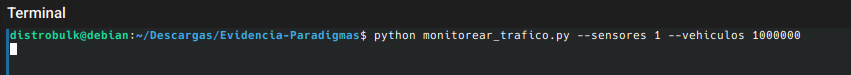 | 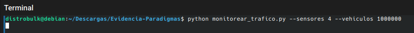 | 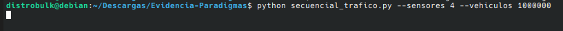 |
    | 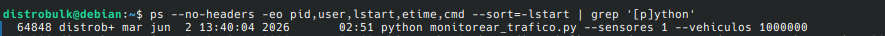 | 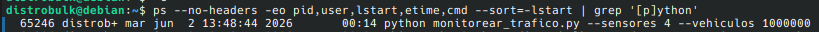 | 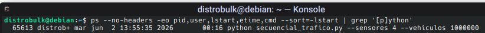 |
    | 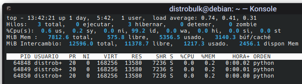 | 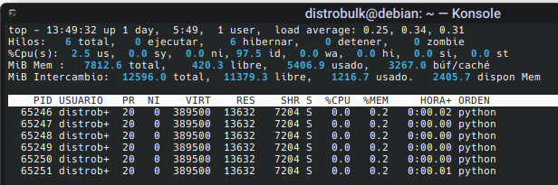 | 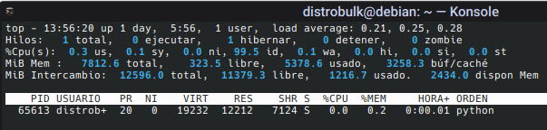 |

## Análisis
Pudo observarse tras las pruebas que efectivamente se utilizaron varios hilos, tan solo para el trabajo de los sensores; también que con un mayor uso de sensores (threads), se favorece al procesamiento de eventos en paralelo, reduciendo significativamente el tiempo total de ejecución al solaparse las esperas (sleep).

En cambio el sistema secuencial mostró un mejor rendimiento temporal cuando el número de sensores y vehículos es muy pequeño, porque no existe overhead* de creación de hilos y procesos, por lo que es más rápido en cargas muy ligeras de sensores.

<sub>\* Entiéndase el tiempo que conlleva asignar recursos para realizar el trabajo útil.</sub>

### Complejidad temporal
En cuanto a la complejidad temporal de c/solución, la versión secuencial tiene complejidad $O(n)$ donde $n$ = sensores x vehículos, pero con tiempo real afectado por la suma de sleeps usados.

En cuanto a la versión concurrente, aunque sigue siendo $O(n)$, se reduce el tiempo de espera a aproximadamente el del sensor más lento gracias al uso de hilos, mientras que el procesamiento paralelo con multiprocessing es el que mejora el cálculo de estadísticas en grandes volúmenes de datos, lo cual es consistente con lo indicado por Aziz et. al (2021), sobre que los programas que utilizan la paralelización para aprovechar los múltiples núcleos se ejecutan más rápido y permiten un mejor uso de los recursos de la CPU.

## Conclusiones
Este sistema demuestra ser mucho más útil para los contextos descritos en un inicio, y lo es en la mediad que su carga de trabajo justifique el overhead inicial. Por otra parte, al sistema secuencial puede atribuírsele la implicación en cuellos de botella y retardos significativos ante un alto volumen de eventos.

## Referencias
- Aziz, Zina & Abdulqader, Diler & Sallow, Amira & Omer, Herman. (2021). Python Parallel Processing and Multiprocessing. Academic Journal of Nawroz University. 10. 10.25007/ajnu.v10n3a1145.
- Herzner, Wolfgang. (2003). Message Queues. Three Patterns for Asynchronous Information Exchange.. 221-242. 
